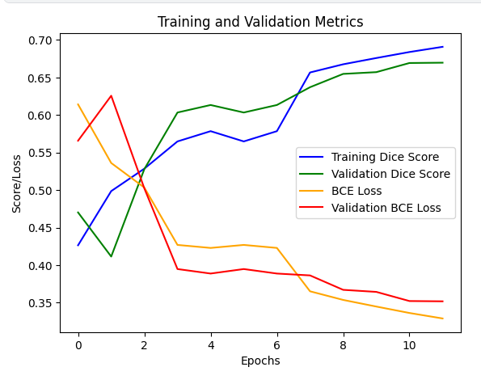

# **Airbus Ship Detection Challenge**

## Overview

This is a supervised U-Net model for image segmentation, specifically for ship identification on satellite images.  

- Loss: Dice score, BCE + Dice Score 
- Optimizer: uses Adam. 
- Activation: ELU + Sigmoid. 
- Kernel initializer: he_normal.

#### Installation

1. Clone the repository.
2. Install dependencies with the pipenv.
3. For training, specify TRAIN_FOLDER in 'train.py' for the training dataset and other parameters.
4. For predicting, specify DATASET_FOLDER in 'predict.py' for the training dataset and other parameters.

#### Structure

'models' - contains saved checkpoints (keras), histories (pickle) and models (keras). Used both for training and predicting.
'output' - for saving original images blended with predicted mask (png).

'src' - contains all the code:
1. 'crop.py' has data generators that are used for cropping or possibly other data manipulations during training.
2. 'interfaces.py' contains abstracts for data generators, save functions, and other possible extensions.
3. 'model.py' has the model structure.
4. 'predict.py' is a script for prediction.
5. 'train.py' is a script for training the model.
6. 'utils.py' contains miscellaneous functions, in the current version - for predicting only.

### Training

To train the model, use the train.py file.

It can use original image size, 3x3, and 2x2 crop data generators for better training and performance optimization. They are located in crop.py, and the mode can be selected in the file.

- Model splits the dataset into training and validation parts.
- Creates checkpoints with the best results.
- Supports loading previously trained versions of the model (.keras) with the history (.pickle) and allows continuing the training.
- In the end, saves the last version of the model with the history.
- Then visualizes the complete history of training (with previous history). The 'visualize' function is responsible for that and can be modified. 

Parameters:

1. ROOT_PATH - a root for the project, by default the value is selected automatically.
2. MODEL_NAME - a model file that will be used to continue the training (optional).
3. HISTORY_NAME - a model file that will be used to continue the training, and contains the data from the previous training sessions (optional).
4. MODELS_FOLDER - a folder from where models will be loaded/to where they will be saved (created if does not exist).
5. TRAIN_FOLDER - a folder with the train dataset images.
6. TRAIN_DATASET_FILE_FOLDER - a folder with the dataset .csv file, by default - the root.
7. EMPTY_IMAGES - how many random empty images will be taken. Relies on the .csv file for it.
8. SHIPS_IMAGES - how many random images with ships will be taken. Relies on the .csv file for it. 
9. MASK_DF - you can use the mask to limit the dataset by specifying EMPTY_IMAGES and SHIPS_IMAGES.
10. EPOCHS - epochs during training.
11. ADAM_RATE - Adam's learning rate that will be used in the optimizer.
12. BATCH_SIZE - a batch size that will be used during training.
13. TEST_PART_SIZE - the size of the validation part.

Leave MODEL_NAME and HISTORY_NAME empty if do not want to load previously saved weights and history.
Other parameters are necessary.

The training dataset should have the following features:

- Images should be homogenous. Exception is raised if otherwise.
- Model has the potential to work with any image shape if decoder function is updated correspondigly. However, the model was tested with square images only and currently set up for square images.
- Image shape is taken from the first image file in the folder.
The dataset should have a .csv file with it for supervised learning.
- The file should have 'ImageId' and 'EncodedPixels' columns.
- Each row should have: 'NaN' if the image does not have a ship, or a single RLE encoded mask for 1 single ship.
- Each image can have multiple masks in different rows.

### Predicting

For predictions, use the predict.py file.

Parameters:

1. MODEL_NAME (necessary) - a model that will be used for predicting.
2. SAMPLE_FOLDER - folder with the dataset images.
3. BLENDED_OUTPUT_FOLDER - Output folder for images with blended with predicted mask (created if does not exist). 
4. sample_set - .csv file with the structure that will be taken as a basis for 'results.csv' and dataset.
5. SAMPLES_LIMIT - quantity of random images from the dataset, basically to limit the process.
6. saver - a class with save functionality for the results. Basic - saving to CSV file in the root directory (creates the file).

The dataset should have the following features:

- Images should be homogenous. Exception is raised if otherwise.
- Model has the potential to work with any image shape if decoder function is updated correspondigly. However, the model was tested with square images only and currently set up for square images.
- Image shape is taken from the first image file in the folder.
- The model does not require you to create a .csv file but it uses 'sample_submission_v2.csv' to create a similar structure for the results file.
- You can create and select different save functions with 'saver'. Basic option - saving to .csv file similar to 'train_ship_segmentations_v2.csv'.
- Dataset could be limited with 'SAMPLES_LIMIT'.
- Each predicted mask is blended with the original image and saved in the output folder for further visual analysis.
- As the next step, the script divides different objects on the predicted masks.
- Every single mask is saved in the results.csv file as a separate row.

Prediction using the following functions from the utils.py file:
1. 'separate_masks' to split masks with multiple ships on the single ones.
2. 'RLE encoder' to encode the predicted and divided mask with a single ship.
3. 'make_blend' that blends the original image with the mask. 

## EDA of the Default Dataset

For detailed analysis, please check the EDA.ipybn file. A short version can be found below.

#### Datatypes

Our analysis shows that columns have np 'object' type which should not be an issue.
In NumPy, 'NaN' is a float.
Values with masks have a 'string' type.

#### Image Quantity:

1. **Train set:**
- Total images - 192 556
- Total rows (empty, single mask, multiple mask) - 231 723
- Total masks (single, multiple masks) - 81 723
- Total unique images with masks (multiple masks do not count) - 42 556
- Without ships (w/o masks) - 150 000

2. **Sample set:**

Total images - 15 606

3. **Total number:** 208 162

As we can see, there are 42556 images with 81723 ships on them.
It means that roughly 1/5 of the dataset has masks (with ships).

#### Visual analysis:

By running the code a few times, we can learn that some images seem to not detect a few ships. However, false positives are not present or rare.

## Image processing

### RLE Decoder

Since masks from the train dataset are RLE encoded, it is necessary to decode them before training. For that, RLE decoder is built-in to the data generator.

### Crop and Data Generators

The generator will apply our crop function to the images.

Typically, when training models for object segmentation tasks (such as ship detection), it is beneficial to retain only the part of the mask that contains the main object to reduce noise and simplify the task for the model.

This approach can also help improve the model's generalization ability since the model will be trained on more specific and informative mask data.

Furthermore, it allows us to train the model with limited computational resources.

It was empirically tested that dividing it 2x2 is less effective than 3x3.

Available modes:

1. Crop2x2Generator
2. Crop3x3Generator
3. NoCropGenerator

Use 'data_generator' in the crop.py file to select one.

## U-Net Model

### Overview

The U-Net model is a convolutional neural network architecture primarily used for image segmentation tasks, especially in the medical imaging field. It was introduced by Olaf Ronneberger, Philipp Fischer, and Thomas Brox in 2015.

The architecture of the U-Net model is characterized by a U-shaped structure, which consists of a contracting path and an expansive path.

The model structure is placed in the model.py file.

### Modifications

This CNN is based on classic U-Net with small changes like:
- Decreased channels == features
- Decreased dropout rate
- Since it is a binary classification case, we will use Sigmoid instead of Softmax
- Consequentially, we will take 'he_normal' instead of 'glorot_uniform' for activation that is more suited for Sigmoid
- Using ELU instead of ReLU.
- Added BatchOptimization

### Decision Rationale

Functional API for Keras was selected for code-reading convenience and compactness.

1. **ELU (Exponential Linear Unit)**

The drawback of ReLU is the "dying ReLU" problem, where the activation becomes negative and remains unchanged during training. However, ELU is also a nonlinear activation function that overcomes the drawbacks of ReLU. ELU retains all the positive aspects of ReLU and reduces the problem of "dying ReLU". ELU can be particularly useful in networks where the tendency for neurons to die is a problem, such as in deep convolutional neural networks.

2. **He Initialization (he_normal)**

This weight initialization method is based on the work of Kaiming He and is intended for networks with activation functions that suffer from saturation issues, such as the Rectified Linear Unit (ReLU). He initialization is recommended for networks with activation functions like ReLU, which may suffer from the "dying ReLU" problem or 'dead neurons'.

3.  **Dropout**

Dropout is an effective regularization technique that improves the generalization ability of neural networks by preventing overfitting and encouraging the learning of robust features. It is especially useful when dealing with large and complex neural networks or datasets where overfitting is a common concern.

4. **BatchNormalization**

In U-Net architecture, BatchNormalization is also usually applied after activation layers. This is a common practice that helps stabilize training and accelerate model convergence. In addition to stabilization, BatchNormalization can also speed up the training process by reducing the need for lower learning rates and helping to avoid issues such as gradient vanishing.

#### Tested Parameters:

1. **Dropout** = 0.2

Higher dropout (about 0.5) resulted in a 'dead neurons' issue.

2. **batch_size** = 16

Lower batch size increases the model's ability to generalize.

3. **Crop** = 3x3

3x3 showed increased accuracy compared to the 2x2 option roughly on 5-9%.

4. **Adam learning rates** = 0.001

Adam is a powerful optimization algorithm that provides efficient convergence and stability during the training of U-Net and other deep neural networks, making it a popular choice for various segmentation tasks in medical imaging, satellite imagery analysis, and other domains.

Taking the recommended values since Adam can optimize its learning rate by itself.

5. **Kf (coefficient, quantity of filters)** = 0.25

Kf is a custom parameter that is used to easily regulate the number of filters on each layer.
Coefficient 0.25 showed a bit faster results than 0.5. However, it is not completely clear at the moment which is better for accuracy.
Coefficiting 1 caused the 'dead neurons' issue.

### Loss Functions

For scoring, two loss functions were tested: the 'Dice Score' and 'BCE + Dice' combination.

1. **Dice Score**

The Dice Score, also known as the Dice Coefficient or Dice Similarity Coefficient, is a measure commonly used to evaluate the performance of image segmentation algorithms, particularly in medical image analysis and computer vision tasks.

It is calculated as the ratio of twice the intersection of the predicted segmentation mask and the ground truth mask to the sum of the number of pixels in both masks.

2. **BCE + Dice Loss**

BCE (Binary Cross-Entropy) loss is used to assess the discrepancy between predicted and true pixel labels, while Dice Loss is used to measure the similarity between segmented regions. Combining these loss functions can help the model achieve a better balance between accuracy and trainability.

For now, only Dice Score is selected.

Loss functions are placed in the train.py file.

## Model Compilation and Dataset Splitting

For checkpoints, you can change the 'callback' variable.

Metrics could be changed during the model compilation.

## Evaluating the Results

After the 11th epoch with the full dataset, metric values:

**6480s 561ms/step - loss: 0.3290 - dice_score: 0.6909 - val_loss: 0.3518 - val_dice_score: 0.6697**

The validation dice score has increased from 47% to 67%, validation loss has decreased from 56% to 35%. The model has not reached its peak yet.

This can be considered as a good start, we can assume that additional 17-20 epochs will be enough to reach the maximum result. Further tests from my side are not possible.

Visual analysis of blended images confirms the shown accuracy.